# BiliV3

> 第三方 B 站 Android 客户端 · Kotlin + Jetpack Compose + Media3

<p align="center">
  <picture>
    <source media="(prefers-color-scheme: dark)" srcset="assets/hero-dark.svg">
    <source media="(prefers-color-scheme: light)" srcset="assets/hero-light.svg">
    
  </picture>
</p>

一个**个人自用**的第三方哔哩哔哩 Android 客户端。目标不是复刻官方 App，
而是把「看视频」这条主链路做到官方级精度：封面为主角、动效只服务反馈、
深浅色两套分层手段各自成立。

---

## 目录

- [项目背景与目标](#项目背景与目标)
- [核心功能](#核心功能)
- [技术栈](#技术栈)
- [环境要求](#环境要求)
- [快速开始](#快速开始)
- [配置说明](#配置说明)
- [项目结构](#项目结构)
- [设计规范](#设计规范)
- [测试](#测试)
- [贡献指南](#贡献指南)
- [许可证](#许可证)
- [免责声明](#免责声明)

---

## 项目背景与目标

第三方 B 站客户端常见的两个极端：一是把官方接口硬套进 Material 3 默认样板，
观感廉价；二是过度装饰，粉色渐变堆满屏，像「少女 App」。

BiliV3 走中间路线 —— **暖调深色底 + 卡片分层 + B 站品牌粉 + 官方级精度**，
目标是「一个认真做过的第三方客户端」。

**明确的非目标**：

- 不解析大会员 / 付费 / 充电专属内容，不绕过任何付费墙
- 不内置去广告、不做批量下载 / 全站爬取
- 不公开分发、不上架商店、不商业化

---

## 核心功能

### 内容浏览

| 模块 | 能力 |
|---|---|
| **首页** | 推荐流（WBI 签名）、Banner 轮播、12 个分区入口、侧栏「正在直播」 |
| **视频详情** | DASH 音视频分离播放、分 P 切换、清晰度/倍速切换、续播提示 |
| **弹幕** | 自绘渲染层、protobuf 解析、本地屏蔽（类型 + 关键词） |
| **评论** | 主评论游标分页、楼中楼回复、发送、举报、IP 属地 |
| **搜索** | 热搜、视频搜索、结果高亮清洗 |
| **分区 / 榜单** | 12 分区最新 / 热门两档 |
| **番剧** | 索引、详情、选集、追番 |
| **直播** | 直播列表（点击打开官方直播间） |
| **用户主页** | 资料卡、投稿列表、关注 / 取关 |
| **动态流** | 关注动态、空间动态 |

### 账号与个人

- **扫码登录** —— 二维码本地生成，过期自动刷新
- **收藏 / 历史 / 稍后再看** —— 跨页状态广播同步
- **离线缓存** —— 断点续传，进度可见
- **私信** —— 消息列表、聊天、未读数红点

### 播放与系统集成

- **画中画（PiP）** —— Activity 级 `PlayerHolder`，切页继续播
- **后台播放** —— 前台服务保活
- **跨端进度同步** —— 本地 `PlaybackProgressStore` + 服务端 `history/report`

### 第三方数据（明确标注来源）

- **查成分** —— 聚合 UID 的评论 / 视频弹幕 / 直播弹幕，数据来源 [aicu.cc](https://www.aicu.cc/)，
  页面明确标注，不冒充官方数据

---

## 技术栈

| 层 | 选型 | 版本 |
|---|---|---|
| 语言 | Kotlin | 2.0.21 |
| UI | Jetpack Compose + Material 3 | BOM 2024.09.02 |
| 播放器 | AndroidX Media3（ExoPlayer + DASH） | 1.4.1 |
| 网络 | OkHttp + 手工容错 JSON 解析 | 4.12.0 |
| 图片 | Coil | 2.7.0 |
| 导航 | navigation-compose | 2.8.4 |
| 存储 | DataStore Preferences + EncryptedSharedPreferences | 1.1.1 / 1.1.0-alpha06 |
| 二维码 | ZXing core | 3.5.3 |
| 构建 | AGP + Gradle + KSP | 8.7.3 / 8.9 / 2.0.21-1.0.28 |
| 测试 | JUnit4 + Truth + coroutines-test | 4.13.2 / 1.4.4 / 1.9.0 |

### 架构

```
UI (Compose) → ViewModel (StateFlow) → Repository → ApiClient
                                                        ├ Wbi（签名）
                                                        ├ Endpoints
                                                        └ 容错 JSON 解析
```

### 几个刻意的架构决策

| 决策 | 理由 |
|---|---|
| **手写 `AppContainer`，不用 Hilt** | 单用户项目，Hilt 会显著拖慢构建 |
| **OkHttp + 容错 `JSONObject`，不用 Retrofit/Moshi 做响应体** | B 站字段类型极不稳定（同字段可能是 Int/String/缺失），强类型反序列化会整页崩 |
| **手写 protobuf，不用 protobuf-javalite / grpc-java** | 省 2~3 MB |
| **`BiliApi` 全应用单例** | CookieJar 持有登录态，多实例 =「登录了但哪里都没登录」 |
| **第三方站点用独立 OkHttpClient** | aicu.cc 不挂 CookieJar，避免把 `SESSDATA` 发给第三方 |
| **接管 OkHttp `Dns` 解决 aicu 连通性** | 根因是 DNS 投毒而非 IP 封锁；比改 hosts 干净、比代理轻 |

---

## 环境要求

| 项 | 要求 |
|---|---|
| JDK | **17+** |
| Android SDK | **API 35**（compileSdk / targetSdk） |
| Gradle | 8.9（wrapper 已内置，指向腾讯镜像） |
| 最低运行版本 | **Android 8.0（API 26）** |
| 推荐 IDE | Android Studio Ladybug 或更新 |

> Gradle wrapper 已配置国内镜像，无需手动配置代理。
> 若在海外网络环境，可自行替换 `gradle/wrapper/gradle-wrapper.properties` 的 `distributionUrl`。

---

## 快速开始

### 1. 克隆

```bash
git clone https://github.com/Hu-Yang-rui/bili-v3-public.git
cd bili-v3-public
```

### 2. 创建 `local.properties`

指向本机 Android SDK（该文件已 gitignore，**不会**入库）：

```properties
sdk.dir=/path/to/android-sdk
```

Windows 示例：

```properties
sdk.dir=C\:\\Users\\<you>\\AppData\\Local\\Android\\Sdk
```

### 3. 构建与测试

```bash
# 单测 + debug + release 全量
./gradlew :app:testDebugUnitTest :app:assembleDebug :app:assembleRelease

# 只跑单测
./gradlew :app:testDebugUnitTest
```

产物：

| 产物 | 大小 | 说明 |
|---|---|---|
| `app/build/outputs/apk/debug/app-debug.apk` | ~23 MB | debug 证书 |
| `app/build/outputs/apk/release/app-release.apk` | ~2.9 MB | R8 + 资源压缩，**需自备签名** |

### 4. 安装

```bash
adb install -r app/build/outputs/apk/debug/app-debug.apk
```

> ⚠️ debug 与 release 证书不同，**不能互相覆盖安装**。换签名类型前先卸载：
> `adb uninstall com.example.biliv3`

---

## 配置说明

### Release 签名

release 构建需要一个签名密钥。三种方式，按顺序回退：

**方式一 · `keystore.properties`（本地开发）**

在仓库根创建（已 gitignore）：

```properties
storeFile=keystore/your-release.jks
storePassword=****
keyAlias=your-alias
keyPassword=****
```

> 该文件刻意保持**纯 ASCII** —— `java.util.Properties.load()` 按 ISO-8859-1 解码。

**方式二 · 环境变量（CI）**

```bash
export BILIV3_STORE_FILE=/abs/path/release.jks
export BILIV3_STORE_PASSWORD=****
export BILIV3_KEY_ALIAS=your-alias
export BILIV3_KEY_PASSWORD=****
```

**方式三 · 都不提供**

构建不会失败 —— release 变体只是**不带签名**。

生成自签密钥：

```bash
keytool -genkeypair -v \
  -keystore keystore/release.jks \
  -alias your-alias \
  -keyalg RSA -keysize 4096 -validity 10950 \
  -storetype PKCS12
```

### 签名验证

本项目 debug 与 release 都显式开启 **v1 + v2 + v3**（`enableV4Signing = false`）。

```bash
apksigner verify --verbose --min-sdk-version 23 --print-certs \
  app/build/outputs/apk/debug/app-debug.apk
```

> ⚠️ **必须指定 `--min-sdk-version 23`（或更低）** 才会校验 v1。
> 默认取 APK 里的 `minSdk=26`，apksigner 会认为「v2 已足够」，
> 于是即便 v1 存在也报 `false` —— 这是「不需要」，不是「没有」。

---

## 项目结构

```
app/src/main/java/com/example/biliv3/
├── design/
│   ├── tokens/       Colors / Dimens / Motion
│   ├── BiliTheme.kt  主题 + 三断点 WindowSize + Shapes
│   └── BiliCard.kt   卡片表面（按主题自动选投影/描边）
├── data/
│   ├── api/          Wbi / Endpoints / BiliApi / AicuDns / AicuApi
│   ├── auth/         AuthRepository / AuthStore / RsaCrypto
│   ├── danmaku/      DanmakuRepository（protobuf 解析）
│   ├── subtitle/     SubtitleGrpcClient / Proto（自写 protobuf）
│   ├── download/     VideoDownloader / DownloadStore
│   ├── model/        VideoItem / VideoDetail / CommentItem / PmModels …
│   └── *Repository.kt
├── nav/              Routes / MainShell
├── player/           PlayerHolder / PlayerFactory
├── util/             ImageCache
├── ui/
│   ├── component/    VideoCard / Skeleton / States / InlinePicker / ItemMoreMenu
│   ├── home/         HomeScreen / TopNav / BannerCarousel / CategoryTabBar / SidePanel
│   ├── video/        VideoDetailScreen / PlayerControls / DanmakuLayer / CommentSection
│   ├── library/      收藏 / 历史 / 稍后再看
│   ├── download/     离线缓存管理
│   ├── dynamic/      动态流
│   ├── space/        用户主页
│   ├── category/     分区页
│   ├── live/         直播列表
│   ├── aicu/         查成分（第三方）
│   ├── message/      私信列表 / 聊天
│   └── search/ ranking/ bangumi/ profile/ settings/ login/
└── MainActivity.kt / AppContainer.kt
```

**规模**：116 个 Kotlin 源文件 / 约 29.5k 行（main）+ 11 个测试文件 / 162 个用例。

---

## 设计规范

全部设计令牌定义在 `design/tokens/`，**页面内禁止硬编码色值与尺寸**。

### 颜色（深色为主态 / 浅色跟随系统）

| 角色 | 深色 | 浅色 |
|---|---|---|
| 页面底 | `#121114` | `#F7F4F6` |
| 卡片 | `#1C1A1F` | `#FFFFFF` |
| 悬浮 | `#26232B` | `#F2EDF0` |
| 主文字 | `#F0EDF2` | `#1A171C` |
| 次文字 | `#A8A2B0` | `#6B6470` |
| 品牌粉 | `#FF8FB0` | `#E8578A` |

> 页面底**刻意不用纯黑**（OLED 拖影）。品牌色做文字不达 WCAG AA，
> 因此派生「文字安全版」用于正文。

### 深色下的分层手段

| 主题 | 手段 | 原因 |
|---|---|---|
| 浅色 | `Modifier.shadow(3dp)` | 白卡浮在浅灰底上，投影清晰可见 |
| 深色 | `Modifier.border(1dp, 10%白)` | **黑底黑影，投影渲染出来几乎为零** |

已封装为 `Modifier.biliCard()`，页面里不要再自己拼 `shadow + background + clip`。

### 尺寸

```
圆角：封面 12 · 面板 16 · 按钮 12 · 角标 2 · 小标签 6 · 胶囊 999
间距：4/8/12/16/20/24/32/40/48
顶栏：桌面 64 · 平板 56 · 移动 52
封面比例：16:10
```

### 动效

页面转场 220ms · 淡入淡出 160ms · 图片淡入 180ms · 骨架微光 1200ms，
缓动统一 `cubic-bezier(0.16, 1, 0.3, 1)`。

> 上面那张顶部动图（`assets/hero-dark.svg`）就是这套令牌的**同源演示**：
> 品牌粉扫光 = 骨架微光相位，弹幕横移 = 页面转场的缓动曲线。
> 用纯 SVG 手写（无 GIF / 无外链），所以它是矢量、可缩放、体积不到 4 KB。

---

## 测试

```bash
./gradlew :app:testDebugUnitTest
```

**12 个测试套件 / 162 个用例**：

| 套件 | 用例 | 覆盖 |
|---|---|---|
| `AicuDnsTest` | 46 | DoH 解析、投毒 IP 校验、跳转映射、最小 JSON 解析 |
| `FeatureLogicTest` | 16 | 跨模块纯逻辑 |
| `CoverUrlTest` | 15 | 封面 URL 归一化 |
| `WbiTest` | 15 | WBI 签名、`percentEncode` 语义 |
| `DanmakuTest` | 13 | 弹幕类型归并、屏蔽过滤 |
| `SubtitleTest` | 12 | 字幕解析 |
| `DownloadLogicTest` | 10 | 下载状态机 |
| `LoginCredentialTest` | 10 | 凭据解析 |
| `ProtoTest` | 10 | 手写 protobuf |
| `FavoritesSyncTest` | 8 | 版本号广播 |
| `CoinSelectionTest` | 7 | 投币选择 / 提交分离 |

---

## 贡献指南

本项目为**个人自用**项目，接受 Issue 与 PR，但请注意：

### 提交前自检

- [ ] `./gradlew :app:testDebugUnitTest :app:assembleDebug :app:assembleRelease` 全绿
- [ ] 编译输出**零新增 warning**
- [ ] 改动文件为合法 UTF-8，**无 BOM**
- [ ] 无死入口（不存在 `onClick = { }` 这类空 lambda）
- [ ] 三态齐全（加载 / 空 / 错误），未登录场景单独处理
- [ ] 页面内无硬编码色值与尺寸（对照 `design/tokens/`）

### Commit message 风格

中文、结构化，**把根因写清楚**；未验证的部分**明确标注**。

```
feat(scope): 一句话说清做了什么

背景：为什么要做（问题是什么）
改动：具体改了什么
验证：跑了什么、结果如何
说明：未验证的部分 / 已知限制 / 取舍理由
```

### 不接受的方向

- 大会员 / 充电 / 打赏 / 付费课程 / 礼物充值 / 装扮等付费增值类功能
- 绕过付费墙、去广告、批量下载、全站爬取
- 投稿 / 创作中心 / 专栏（第三方客户端无此能力）

---

## 许可证

[PolyForm Noncommercial License 1.0.0](LICENSE)

**源码公开，但禁止商业用途。** 你可以自由阅读、修改、自用本项目，
但不得用于任何商业目的，也不得用于绕过哔哩哔哩的任何付费与访问限制。

> 这与项目「个人自用、不公开分发、不商业化」的定位一致。
> 若你需要在商业场景使用，请另行联系作者取得授权。

---

## 免责声明

- 本项目为**个人学习与自用**的第三方客户端，**与哔哩哔哩（Bilibili）官方无任何关联**，
  不代表官方立场，也未获得官方授权或认可。
- 项目内**不使用** B 站 Logo、商标或专有图标；所有图标为 Material 通用图标与自绘几何形状。
- 所有内容数据均来自 B 站公开接口，版权归原作者及哔哩哔哩所有。
- 第三方聚合数据（[aicu.cc](https://www.aicu.cc/)）在页面明确标注来源，不冒充官方数据。
- **请勿将本项目用于商业用途或公开分发。** 使用者需自行承担因使用本项目产生的一切风险
  与法律责任，作者不对任何直接或间接损失负责。
- 本项目不解析、不绕过任何付费内容与访问限制。
