<div align="center">

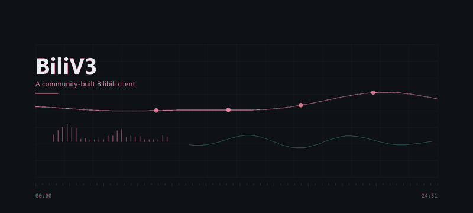

# BiliV3

**A community-built Bilibili client for Android.**

<p>
  <a href="../../releases/latest"></a>
  
  
  
  
</p>

<p>
  <a href="../../releases/latest"><b>Download APK</b></a> ·
  <a href="../../issues">Issues</a> ·
  <a href="#architecture">Architecture</a> ·
  <a href="#plugins">Plugins</a>
</p>

</div>

---

## About

A third-party Bilibili client built around **video playback, audio experience, content management and plugin extension**.

Not a clone of the official app. The goal is to take one path — *watching something* — and make it feel considered all the way through: a dark, quiet interface, motion that exists only to give feedback, and a playback core that behaves the same whether you are watching, listening, or with the screen off.

<div align="center">
<sub><b>Kotlin</b> · <b>Jetpack Compose</b> · <b>Media3</b> · <b>379 unit tests</b></sub>
</div>

---

## Player

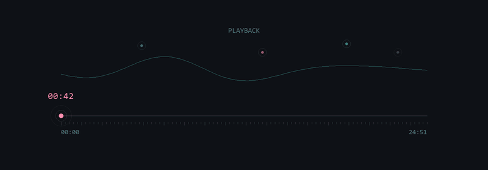

**One playback core, one source of truth.**

The player, the queue, the notification and the lock screen all read the *same* `StateFlow`. There is no second player and no second progress store, so "UI says playing, notification says paused" cannot happen by construction.

Bilibili serves DASH as **two independent URLs** — video and audio. Media3's `MergingMediaSource` joins them natively; no ffmpeg, no remux step.

<details>
<summary><b>Why a single writer matters</b></summary>

<br>

`PlaybackController` is the only thing that mutates playback state. Everything else observes.

The alternative — UI, notification and MediaSession each keeping their own copy — fails the moment one of them misses an update, and the failure is silent: nothing crashes, the two just quietly disagree. Making one component the sole writer removes the whole class of bug rather than patching individual cases.

</details>

---

## Listen Mode

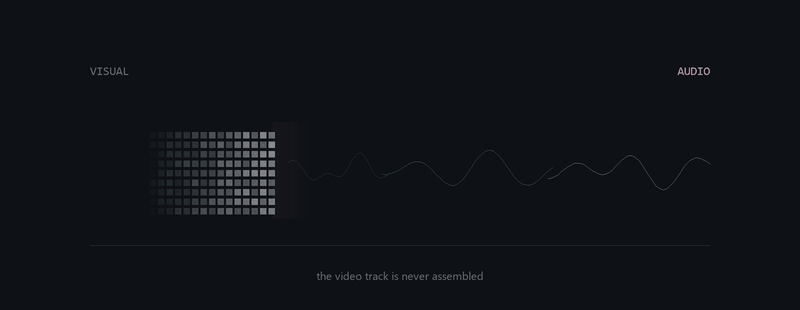

**Video becomes audio. The video track is never assembled.**

This is not the same as hiding the picture. Hiding it still decodes video and still composites frames — you pay the battery and get nothing. Leaving the track out of the `MediaSource` means **no video decoder is created at all**.

The cost is that switching modes must rebuild the source, so position is captured first and seeked back afterwards. Otherwise every switch would restart from zero.

<details>
<summary><b>Background playback and lock screen</b></summary>

<br>

`MediaSessionService` keeps audio alive after the activity is gone, and gives the system media centre — lock screen controls, headset buttons — something to drive.

The cross-process boundary only carries serialisable data, and `MediaController` accepts a `MediaItem`, not a `MergingMediaSource`. So the audio URL is encoded into `MediaItem.extras` and rebuilt on the service side. When an object will not cross a boundary, encode it as data and reconstruct it on the far side.

</details>

---

## Playback Memory


**It remembers where you stopped — per part, not per video.**

Progress is keyed by **`bvid:cid`**, so every part of a multi-part video keeps its own position. Two thresholds, deliberately different numbers rather than one value used twice:

| | value | meaning |
|---|---|---|
| near end | `0.95` | stop offering "continue watching" — otherwise you dismiss it every time |
| complete | `0.90` | count as finished and drop it from the resume list |

Local storage handles immediacy; `history/report` handles cross-device continuity. Both are needed.

---

## Favorites & Organize

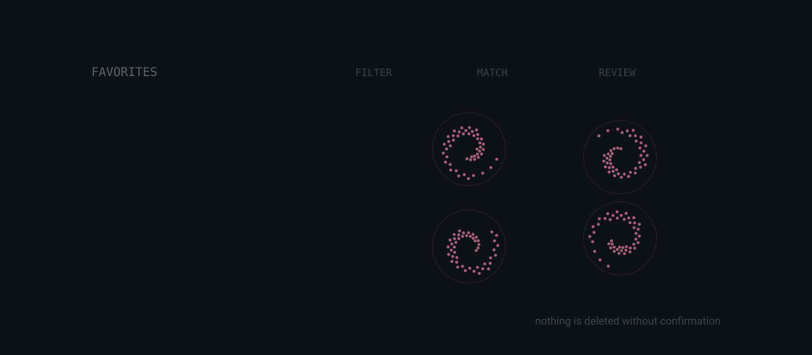

**Rules narrow the range. A person decides.**

A long-lived favourites folder fills with things you saved without remembering why, and opening each one to judge it is too slow. So: multi-select with select-all / invert / this-page, batch move, batch unfavourite, batch add to watch-later or queue — destructive actions behind a confirmation that states the count.

**Quick organize** uses a rule plugin to surface candidates along with the reason each one matched. You review the candidates and decide.

> Deliberately not automatic. Favourites are not recoverable server-side — there is no recycle bin — and any rule will be wrong sometimes.

<details>
<summary><b>Why batch operations are not optimistic</b></summary>

<br>

A single unfavourite is applied optimistically: remove it, restore it if the call fails. Low failure rate, one item, and the user only cares about that item.

Batch is different. On partial failure, *which* items succeeded becomes unknowable — restoring the failures needs their original positions, and positions have already shifted under concurrent edits. So batch waits for the result and filters by `BatchResult` afterwards. Slower, and honest.

</details>

---

## Queue

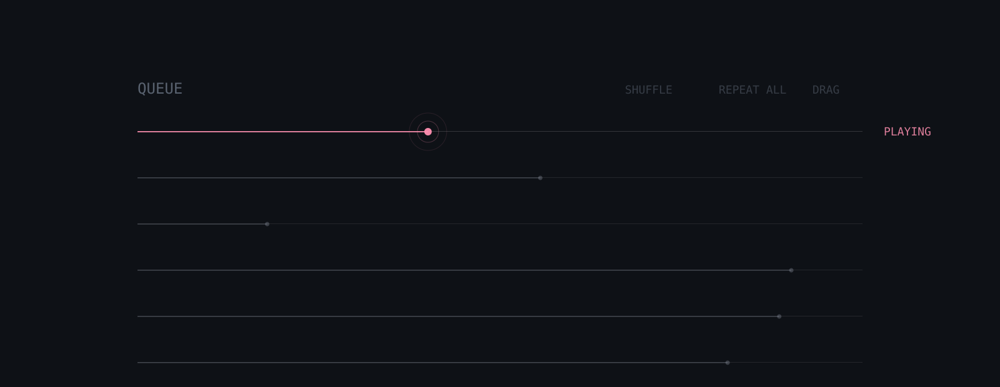

**Independent of the player, and therefore testable.**

`PlaybackQueue` is plain Kotlin and holds no `ExoPlayer` reference, so its logic runs in unit tests without an emulator. Two boundaries that are easy to get wrong are pinned down there:

- Under **repeat-one**, a track that ends naturally replays; but a user pressing *next* must still advance. Same "ended" event, opposite intent — distinguished by a parameter, not inferred.
- With **shuffle** on, the current track is pinned to the head of the shuffled order. Otherwise pressing shuffle makes the song jump out from under you.

---

## Lyrics

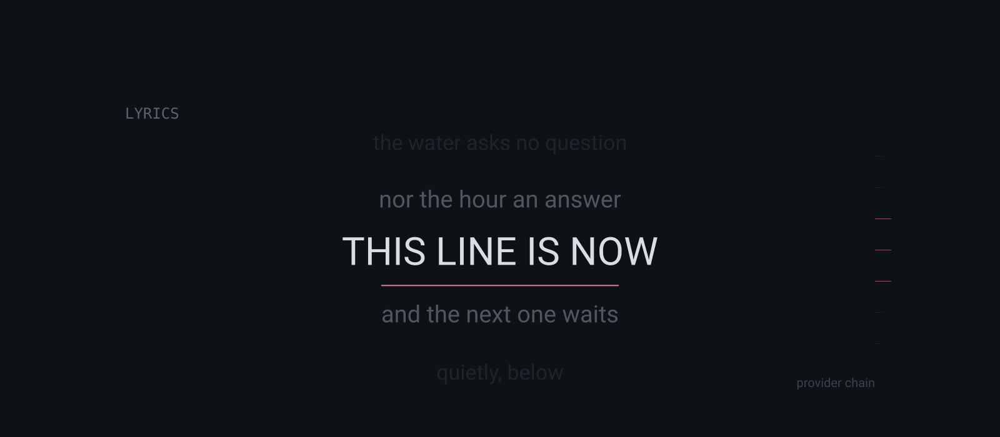

**A provider chain, not a hardcoded site.**

Lyrics come from a chain of `LyricsProvider`s — subtitles first, reusing the existing subtitle pipeline, with a third-party source as fallback. No site is wired into the UI.

Handles LRC parsing (`[offset:]`, multiple time tags, 1–3 decimal places), auto-scroll, tap-to-seek and a manual offset nudge.

<details>
<summary><b>"No lyrics" and "failed" are different states</b></summary>

<br>

- `NoLyrics` — the track genuinely has none. **No retry button**: retrying cannot conjure them.
- `Failed` — network or parse error. **Retry is required.**

The chain keeps walking on both `Unavailable` and `Error` (a broken subtitle source does not imply the local one is broken). Only when every provider is exhausted does it report failure, and it keeps the **first** error, which is closest to the root cause.

</details>

---

## Vinyl

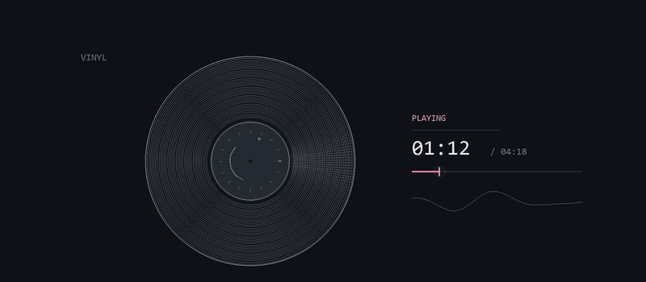

Cover art set into the record's centre label, with a soft specular sweep travelling around the disc.

**Pausing freezes the angle rather than resetting it** — returning to zero reads as "playback restarted". Rotation is disabled entirely on low-tier devices.

---

## Plugins

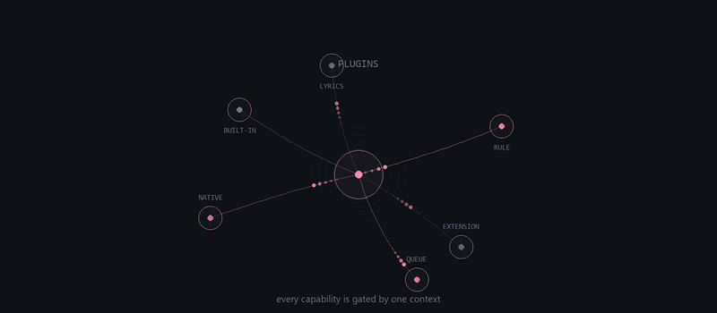

Four kinds, with different capability and isolation levels:

| kind | form | constraint |
|---|---|---|
| **Built-in** | compiled in | no extra permissions |
| **JSON rule** | fixed-enum sandbox interpreter | **never executes arbitrary code**; no loops, no calls; regex and input both length-capped against catastrophic backtracking |
| **Native** | Kotlin API | capability funnelled through `PluginContext` |
| **External package** | `.bvplugin` | preview only, **never unpacked to disk** — immune to Zip Slip by construction; entry count and per-file size capped against zip bombs |

**Permissions are the only door.** Every `PluginContext` method checks first, so "quietly reach for a Repository or a cookie" is a compile error rather than a matter of discipline. `SESSDATA`, `bili_jct` and the keystore never enter a plugin.

**External packages are previewed before install:** scan → parse → show permissions and risk level → compatibility check → explicit confirm → install.

**Failures are isolated.** Exceptions are caught as `Throwable` (it may be a `StackOverflowError`), and three consecutive failures auto-disable the plugin.

<details>
<summary><b>A plugin throwing is not the same as a plugin blocking</b></summary>

<br>

Both look like "no text came back", and they mean opposite things:

| | meaning | correct behaviour |
|---|---|---|
| hook returns `null` | the plugin **intends** to block this | drop the danmaku |
| hook **throws** | the plugin is **broken** | **keep the danmaku**, log the error |

Conflating them means one null-pointer in a plugin silently removes every danmaku in the video.

</details>

---

## Architecture


```
UI (Compose) → ViewModel (StateFlow) → Repository → ApiClient
                                                        ├ Wbi
                                                        ├ Endpoints
                                                        └ tolerant JSON
```

**The volatile parts are confined to three files**: `Endpoints.kt`, `Wbi.kt`, `BiliApi.kt`.

### Deliberate choices

| decision | reason |
|---|---|
| **hand-written `AppContainer`**, no Hilt | single-user project; Hilt would slow the build further on top of KSP |
| **manual tolerant JSON**, no Retrofit / Moshi | Bilibili field types are unstable — the same field arrives as Int, String or absent. Strict deserialisation fails the whole page |
| **hand-written protobuf** | saves 2–3 MB, and only a few fixed structures need reading |
| **dark theme only** | see below |
| **no cards** | a card is a container around a container; grouping uses spacing, hairlines and brightness instead |

<details>
<summary><b>Why there is no light theme</b></summary>

<br>

Glassmorphism needs something behind it to blur. The video page has that. Static pages — home, search, profile — sit on a flat colour, so there is nothing to blur.

On a flat background, "glass" can only pretend by being *lighter than the background*. That is not glass, it is a white card. The choice was therefore between maintaining two entirely different material strategies, or shipping one that is fake. Neither is good.

**So: dark only, done properly.** A side benefit is that every `isDark` branch disappears, along with the class of bug where the glass recipe picks the wrong variant.

</details>

<details>
<summary><b>Where glass is allowed</b></summary>

<br>

Glass is not a default material. It is used only where there is genuinely something behind it and where precise tapping is not required.

| context | glass? |
|---|---|
| display overlay above video | yes — exactly one in the whole app |
| player tools (gear, quality, speed, subtitles, danmaku) | no — solid panels |
| dialogs, menus, lists, bars, tabs | no |

A tool layer needs to be *hit accurately*. Blurring its edges and lowering its icon contrast works against that — glass there is a downgrade, not a finish.

</details>

---

## Security

| | |
|---|---|
| **Credentials** | `SESSDATA` encrypted via Android Keystore (`EncryptedSharedPreferences`) |
| **Third parties** | aicu.cc uses a **separate OkHttpClient with no CookieJar** — sharing one would send Bilibili cookies to a third party in plaintext |
| **Keys** | `keystore/` and `keystore.properties` never enter the repo; this repository is public |
| **Releases** | release APKs only, never debug |
| **Plugins** | cookies never reach a plugin; capabilities gated by `PluginContext` |

<details>
<summary><b>Why debug APKs are never published</b></summary>

<br>

Two independent problems, not a matter of file size:

1. **`debuggable=true`** — anyone holding the APK can use `adb run-as` to read the app's private data, including the encrypted credential store.
2. **It is signed with a public key.** `CN=Android Debug` ships with the Android SDK. Anyone can sign an APK with the *same package name and same certificate*, and the device treats it as a **legitimate upgrade**.

The second is the dangerous one: it needs no root and no user trust. Same package name plus same signature *is* Android's upgrade test.

</details>

### Compliance

- No paid, membership or charged-exclusive content; no paywall is bypassed
- No ad-blocking, no bulk downloading, no site-wide crawling
- Not publicly distributed, not on any store, not commercialised
- Login with a secondary account only
- Third-party data ([aicu.cc](https://www.aicu.cc/)) is labelled as such on the page, never presented as official
- No Bilibili logo, trademark or proprietary iconography is used

> Bilibili's terms prohibit unauthorised third-party clients. This is a personal, non-distributed project.

---

## Download

<div align="center">

<p>
  <a href="../../releases/latest"></a>
</p>

**`bili-v3-v1.4.1-release.apk`** · 3.42 MB · `versionCode 32`

</div>

| | |
|---|---|
| Certificate | `CN=BiliV3 Release` / RSA 4096 |
| Signing | v1 + v2 + v3 |
| Validity | 30 years |
| SHA-256 | `FF88D3B71FBE9A8BD64A66B1F6DD821043CDD84037C830112A9424E366E6D98A` |

### Install

1. Download `bili-v3-<tag>-release.apk` from [Releases](../../releases/latest)
2. Allow installing from unknown sources
3. Install

If you hit a signature conflict, remove the old build first:

```bash
adb uninstall com.example.biliv3
```

### Build

```bash
# JDK 17+ / Android SDK 35 / Gradle 8.9
./gradlew :app:testDebugUnitTest :app:assembleDebug :app:assembleRelease
```

```
app/build/outputs/apk/debug/app-debug.apk        # ~23 MB
app/build/outputs/apk/release/app-release.apk    # ~3.4 MB, R8 + resource shrinking
```

`local.properties` (gitignored):

```properties
sdk.dir=/path/to/android-sdk
```

`keystore.properties` (gitignored, back it up yourself):

```properties
storeFile=keystore/biliv3-release.jks
storePassword=***
keyAlias=biliv3
keyPassword=***
```

Missing credentials fall back to `BILIV3_*` environment variables; if neither is present the release build ships unsigned rather than failing.

Verify signing:

```powershell
powershell -ExecutionPolicy Bypass -File tool\verify-signature.ps1
```

---

## Community

This is a personal project that happens to be public. Issues and pull requests are welcome, though there is no support commitment and no roadmap.

- **Bugs / ideas** → [Issues](../../issues)
- **Source** → [`app/src/`](app/src)
- **Project conventions, measured facts and known pitfalls** → [`AGENTS.md`](AGENTS.md)

### Feature overview

| module | capability |
|---|---|
| **Home** | recommendation feed (WBI-signed), banner carousel, 12 category entries, live sidebar |
| **Video detail** | DASH playback, part switching, quality / speed, resume prompt |
| **Player** | unified core, queue, sleep timer, PiP, background playback, media session |
| **Listen / Vinyl** | audio-only mode with no video track; rotating record |
| **Lyrics** | provider chain, LRC parsing, auto-scroll, offset nudge |
| **Danmaku** | custom renderer, protobuf parsing, local filtering by type and keyword |
| **Favorites** | batch multi-select, rule-driven quick organize, local tags |
| **Comments** | cursor paging, nested replies, posting, reporting, IP region |
| **Search / Category / Ranking** | hot searches, highlight cleanup; 12 categories, latest and popular |
| **Bangumi** | index, detail, episode list, follow |
| **Profile / Dynamic** | user card, uploads, follow; following feed and space feed |
| **Account** | QR login, account switching, history, watch-later, offline cache with resume, PM |
| **Plugins** | built-in / JSON rule / native / external package, gated permissions, isolated failures |

---

## License

[MIT](LICENSE)

<details>
<summary><b>Still frames</b> — full-resolution vectors of the animated scenes above</summary>

<br>

The scenes that animate above also ship as vector stills. Useful for slides, posts, or anywhere a GIF will not play.

<p>
  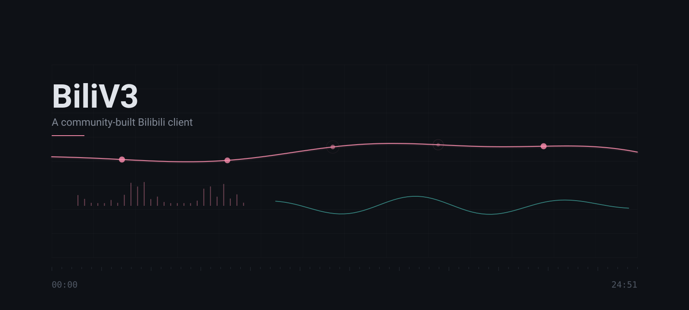
  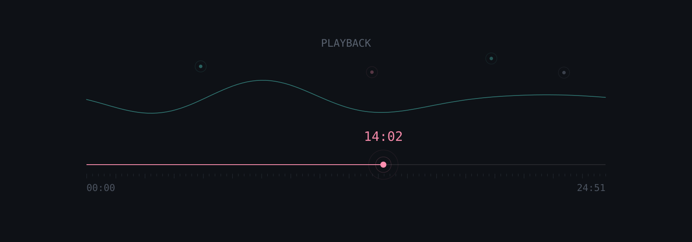
</p>
<p>
  
  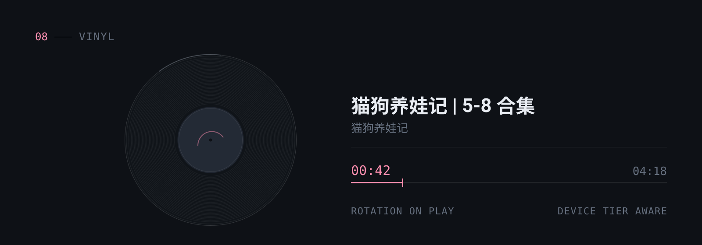
</p>
<p>
  
</p>

</details>

<div align="center">
<br>
<sub>Not affiliated with Bilibili. Built with Kotlin, Jetpack Compose and Media3.</sub>
</div>
