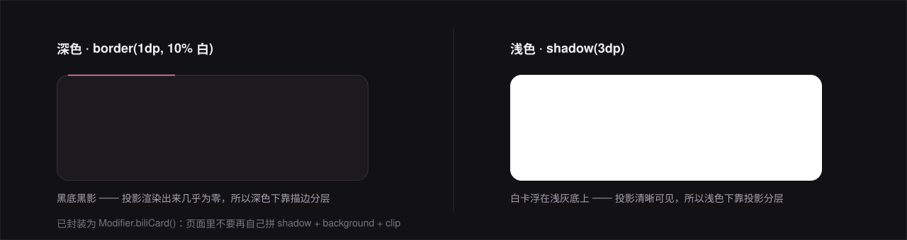
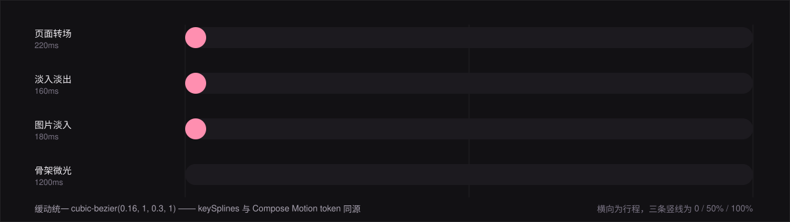

# BiliV3

> 第三方 B 站 Android 客户端 · Kotlin + Jetpack Compose + Media3

<p align="center">
  <picture>
    <source media="(prefers-color-scheme: dark)" srcset="assets/hero-dark.svg">
    <source media="(prefers-color-scheme: light)" srcset="assets/hero-light.svg">
    
  </picture>
</p>

一个**个人自用**的第三方哔哩哔哩 Android 客户端。目标不是复刻官方 App，
而是把「看视频」这条主链路做到官方级精度：封面为主角、动效只服务反馈、
深浅色两套分层手段各自成立。

> 目录用 GitHub 右上角的 **☰ outline** 即可，不再手写一份（会漂移）。

---

## 项目背景与目标

第三方 B 站客户端常见的两个极端：一是把官方接口硬套进 Material 3 默认样板，
观感廉价；二是过度装饰，粉色渐变堆满屏，像「少女 App」。

BiliV3 走中间路线 —— **暖调深色底 + 卡片分层 + B 站品牌粉 + 官方级精度**，
目标是「一个认真做过的第三方客户端」。

**明确的非目标**：不解析大会员 / 付费 / 充电专属内容，不绕过任何付费墙；
不内置去广告，不做批量下载 / 全站爬取；不公开分发、不上架商店、不商业化。

---

## 核心功能

| 模块 | 能力 |
|---|---|
| **首页** | 推荐流（WBI 签名）、Banner 轮播、12 个分区入口、侧栏「正在直播」 |
| **视频详情** | DASH 音视频分离播放、分 P 切换、清晰度/倍速切换、续播提示 |
| **弹幕** | 自绘渲染层、protobuf 解析、本地屏蔽（类型 + 关键词） |
| **评论** | 主评论游标分页、楼中楼回复、发送、举报、IP 属地 |
| **搜索 / 分区 / 榜单** | 热搜、结果高亮清洗；12 分区最新 / 热门两档 |
| **番剧** | 索引、详情、选集、追番 |
| **直播** | 直播列表（点击打开官方直播间） |
| **用户主页 / 动态流** | 资料卡、投稿列表、关注取关；关注动态、空间动态 |
| **账号与个人** | 扫码登录、收藏 / 历史 / 稍后再看、离线缓存（断点续传）、私信 |
| **播放与系统集成** | 画中画（Activity 级 `PlayerHolder`）、后台播放、跨端进度同步 |

**第三方数据（明确标注来源）**：查成分聚合 UID 的评论 / 视频弹幕 / 直播弹幕，
数据来源 [aicu.cc](https://www.aicu.cc/)，页面明确标注，不冒充官方数据。

---

## 技术栈

| 层 | 选型 | 版本 |
|---|---|---|
| 语言 / UI | Kotlin + Jetpack Compose + Material 3 | 2.0.21 / BOM 2024.09.02 |
| 播放器 | AndroidX Media3（ExoPlayer + DASH） | 1.4.1 |
| 网络 / 图片 | OkHttp + 手工容错 JSON 解析 / Coil | 4.12.0 / 2.7.0 |
| 导航 / 存储 | navigation-compose / DataStore + EncryptedSharedPreferences | 2.8.4 / 1.1.1 · 1.1.0-alpha06 |
| 构建 / 测试 | AGP + Gradle + KSP / JUnit4 + Truth + coroutines-test | 8.7.3 / 8.9 / 2.0.21-1.0.28 |

### 架构

<p align="center">
  
</p>

脉冲一个周期 2.6s，依次点亮四层主干与三个易变点 ——
**把易变的收敛到 3 个文件**：`Endpoints` / `Wbi` / `BiliApi`。

### 几个刻意的架构决策

| 决策 | 理由 |
|---|---|
| **手写 `AppContainer`，不用 Hilt** | 单用户项目，Hilt 会显著拖慢构建 |
| **OkHttp + 容错 `JSONObject`，不用 Retrofit/Moshi** | B 站字段类型极不稳定（同字段可能是 Int/String/缺失），强类型反序列化会整页崩 |
| **手写 protobuf，不用 protobuf-javalite / grpc-java** | 省 2~3 MB |
| **`BiliApi` 全应用单例** | CookieJar 持有登录态，多实例 =「登录了但哪里都没登录」 |
| **第三方站点用独立 OkHttpClient** | aicu.cc 不挂 CookieJar，避免把 `SESSDATA` 发给第三方 |
| **接管 OkHttp `Dns` 解决 aicu 连通性** | 根因是 DNS 投毒而非 IP 封锁；比改 hosts 干净、比代理轻 |

---

## 环境要求

**JDK 17+** · **Android SDK 35**（compileSdk / targetSdk）· **Gradle 8.9**
（wrapper 已内置，指向腾讯镜像，无需手动配代理）· 最低运行 **Android 8.0（API 26）** ·
推荐 Android Studio Ladybug 或更新。

> 若在海外网络环境，可自行替换 `gradle/wrapper/gradle-wrapper.properties` 的 `distributionUrl`。

---

## 快速开始

```bash
git clone https://github.com/Hu-Yang-rui/bili-v3-public.git
cd bili-v3-public

# 指向本机 Android SDK（已 gitignore，不会入库）
echo 'sdk.dir=/path/to/android-sdk' > local.properties

# 单测 + debug + release 全量
./gradlew :app:testDebugUnitTest :app:assembleDebug :app:assembleRelease

# 安装（**用 release 包**，原因见下）
adb install -r app/build/outputs/apk/release/app-release.apk
```

| 产物 | 大小 | 说明 |
|---|---|---|
| `app-release.apk` | ~2.9 MB | R8 + 资源压缩，`debuggable=no`，**推荐** |
| `app-debug.apk` | ~23 MB | 仅本地调试用，**不要对外分发**（见下） |

> ⚠️ **为什么公开渠道只发 release 包**
>
> debug 包不适合分发，有三个实际问题：
> 1. 它用 Android **公开**调试密钥签名（口令 `android`、别名
>    `androiddebugkey` 都是公开值），任何人都能签出同包名 APK，
>    而设备会把它当作**合法更新**接受 —— 属于供应链投毒入口
> 2. `debuggable=true`，`adb run-as` 可读取其私有数据
> 3. 与 release **签名不同**，两者互装必须先卸载；而本项目
>    `allowBackup="false"`，**卸载即丢登录态与设置**
>
> 因此 [Releases](https://github.com/Hu-Yang-rui/bili-v3-public/releases)
> 只提供 release 包。需要 debug 包请自行构建。

> ✅ 同签名 + versionCode 递增（如 11 → 12 → 13）**可直接覆盖安装**，
> 登录态与设置保留，无需卸载。这是正常升级路径。

---

## 配置说明

release 构建需要签名密钥，按顺序回退；**三级都不提供也不会构建失败** ——
release 变体只是不带签名。

```properties
# ① keystore.properties（本地开发，已 gitignore，刻意保持纯 ASCII ——
#    java.util.Properties.load() 按 ISO-8859-1 解码）
storeFile=keystore/your-release.jks
storePassword=****
keyAlias=your-alias
keyPassword=****
```

```bash
# ② 环境变量（CI）
export BILIV3_STORE_FILE=/abs/path/release.jks
export BILIV3_STORE_PASSWORD=****
export BILIV3_KEY_ALIAS=your-alias
export BILIV3_KEY_PASSWORD=****

# ③ 生成自签密钥
keytool -genkeypair -v -keystore keystore/release.jks -alias your-alias \
  -keyalg RSA -keysize 4096 -validity 10950 -storetype PKCS12
```

### 签名验证

debug 与 release 都显式开启 **v1 + v2 + v3**（`enableV4Signing = false`）。

```bash
apksigner verify --verbose --min-sdk-version 23 --print-certs \
  app/build/outputs/apk/release/app-release.apk
```

> ⚠️ **必须指定 `--min-sdk-version 23`（或更低）** 才会校验 v1。
> 默认取 APK 里的 `minSdk=26`，apksigner 会认为「v2 已足够」，
> 于是即便 v1 存在也报 `false` —— 这是「不需要」，不是「没有」。

---

## 项目结构

```
app/src/main/java/com/example/biliv3/
├── design/           tokens/ (Colors·Dimens·Motion) · BiliTheme · BiliCard
├── data/
│   ├── api/          Wbi · Endpoints · BiliApi · AicuDns · AicuApi
│   ├── auth/         AuthRepository · AuthStore · RsaCrypto
│   ├── danmaku/      DanmakuRepository（protobuf 解析）
│   ├── subtitle/     SubtitleGrpcClient · Proto（自写 protobuf）
│   ├── download/     VideoDownloader · DownloadStore
│   ├── model/        VideoItem · VideoDetail · CommentItem · PmModels …
│   └── *Repository.kt    Home / Video / Comment / Pm / Library / Space /
│                         Dynamic / Category / Live / Bangumi …
├── nav/              Routes · MainShell
├── player/           PlayerHolder · PlayerFactory
├── util/             ImageCache
├── ui/               component/ · home/ · video/ · library/ · download/ ·
│                     dynamic/ · space/ · category/ · live/ · aicu/ ·
│                     message/ · search/ · ranking/ · bangumi/ ·
│                     profile/ · settings/ · login/
└── MainActivity.kt · AppContainer.kt
```

**规模**：116 个 Kotlin 源文件 / 约 29.5k 行（main）+ 11 个测试文件 / 162 个用例。

---

## 设计规范

全部设计令牌定义在 `design/tokens/`，**页面内禁止硬编码色值与尺寸**。

### 颜色

<p align="center">
  
</p>

页面底**刻意不用纯黑**（OLED 拖影）。品牌色做文字不达 WCAG AA，
因此派生「文字安全版」用于正文 —— 原色保留做背景 / 图标。

### 深色下的分层手段

<p align="center">
  
</p>

| 主题 | 手段 | 原因 |
|---|---|---|
| 浅色 | `Modifier.shadow(3dp)` | 白卡浮在浅灰底上，投影清晰可见 |
| 深色 | `Modifier.border(1dp, 10%白)` | **黑底黑影，投影渲染出来几乎为零** |

已封装为 `Modifier.biliCard()`，页面里不要再自己拼 `shadow + background + clip`。

### 尺寸与动效

```
圆角：封面 12 · 面板 16 · 按钮 12 · 角标 2 · 小标签 6 · 胶囊 999
间距：4/8/12/16/20/24/32/40/48
顶栏：桌面 64 · 平板 56 · 移动 52        封面比例：16:10
```

<p align="center">
  
</p>

页面转场 220ms · 淡入淡出 160ms · 图片淡入 180ms · 骨架微光 1200ms，
缓动统一 `cubic-bezier(0.16, 1, 0.3, 1)` —— 图里滑块的 `keySplines`
与 Compose Motion token 是**同一条曲线**。

> 本 README 的五张图全部是**纯手写 SVG**（无 GIF / 无外链 / 无 JS），
> 矢量、可缩放、单张 4~10 KB。深浅主题由 `<picture>` 或 SVG 内联 CSS 自适应，
> 一份文件两套配色；且每张都按「SMIL 不执行时静态帧也成立」的标准构图。

---

## 测试

```bash
./gradlew :app:testDebugUnitTest
```

**11 个测试套件 / 162 个用例**。重点覆盖：`AicuDnsTest` 46（DoH 解析、投毒 IP
校验、跳转映射、最小 JSON 解析）、`FeatureLogicTest` 16、`CoverUrlTest` 15、
`WbiTest` 15（签名 + `percentEncode` 语义）、`DanmakuTest` 13（类型归并 + 屏蔽
过滤）、`SubtitleTest` 12，其余 5 套件 45 个用例覆盖下载状态机、凭据解析、
手写 protobuf、版本号广播、投币「选择 / 提交」分离。

---

## 贡献指南

本项目为**个人自用**项目，接受 Issue 与 PR。

**提交前自检**：`./gradlew :app:testDebugUnitTest :app:assembleDebug :app:assembleRelease`
全绿 · 编译**零新增 warning** · 改动文件为合法 UTF-8 且**无 BOM** ·
无死入口（不存在 `onClick = { }` 这类空 lambda）· 三态齐全（加载 / 空 / 错误，
未登录场景单独处理）· 页面内无硬编码色值与尺寸（对照 `design/tokens/`）。

**Commit message 风格**：中文、结构化，**把根因写清楚**，未验证的部分**明确标注**。

```
feat(scope): 一句话说清做了什么

背景：为什么要做（问题是什么）
改动：具体改了什么
验证：跑了什么、结果如何
说明：未验证的部分 / 已知限制 / 取舍理由
```

**不接受的方向**：大会员 / 充电 / 打赏 / 付费课程 / 礼物充值 / 装扮等付费增值类；
绕过付费墙、去广告、批量下载、全站爬取；投稿 / 创作中心 / 专栏（第三方客户端无此能力）。

---

## 许可证

[PolyForm Noncommercial License 1.0.0](LICENSE)

**源码公开，但禁止商业用途。** 你可以自由阅读、修改、自用本项目，
但不得用于任何商业目的，也不得用于绕过哔哩哔哩的任何付费与访问限制。
若需商业场景使用，请另行联系作者取得授权。

---

## 免责声明

- 本项目为**个人学习与自用**的第三方客户端，**与哔哩哔哩（Bilibili）官方无任何关联**，
  不代表官方立场，也未获得官方授权或认可。
- 项目内**不使用** B 站 Logo、商标或专有图标；所有图标为 Material 通用图标与自绘几何形状。
- 所有内容数据均来自 B 站公开接口，版权归原作者及哔哩哔哩所有。
- 第三方聚合数据（[aicu.cc](https://www.aicu.cc/)）在页面明确标注来源，不冒充官方数据。
- **请勿将本项目用于商业用途或公开分发。** 使用者需自行承担因使用本项目产生的一切风险
  与法律责任，作者不对任何直接或间接损失负责。
- 本项目不解析、不绕过任何付费内容与访问限制。
